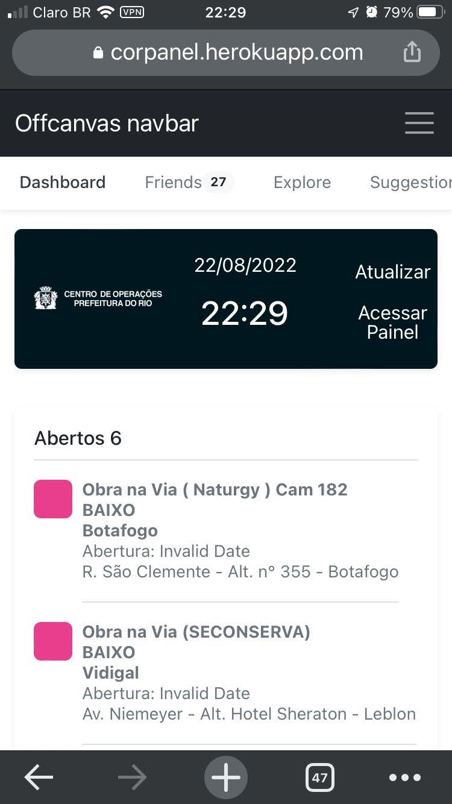

# CorPanel
[](https://corpanel.herokuapp.com/)

## Objetivos:

* Exibir chamdados fechados do dia.
* Exibir todos os chamados em aberto.
* Exibir detalhes do chamado.
* Exibir mapa de onde ocorreu o chamado.

## Uso
```bash
npm run dev
# or
yarn dev

docker build -t nextjs-docker .
docker run -p 3000:3000 nextjs-docker
```
## 🛠 Tecnologias
* [Maplibre-gl](https://maplibre.org/)
* [NextJs](https://nextjs.org/)
* [Date-fns](https://date-fns.org/)
* [React-query](https://tanstack.com/query/v4/)
* [React](https://reactjs.org/)
* [TypeScript](https://www.typescriptlang.org/)
* [Node >=16](https://nodejs.org/)

## Capturas de Tela
* Tela Principal: 
* Tela Principal: 
* Tela Principal Com Mapa: 
